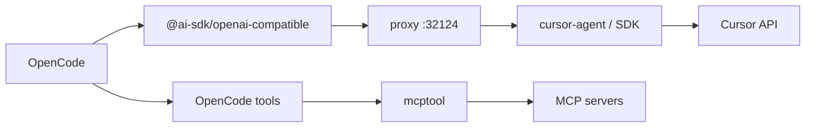
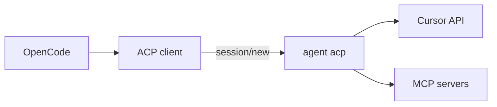

# Cursor ACP + MCP — Future Architecture

- **Status:** Deferred; ACP is available but does not yet solve tool ownership
- **Last reviewed:** 2026-06-28
- **Cursor Agent tested:** `2026.06.26-7079533`
- **Today:** `open-cursor` bridge — [runtime-tool-loop.md](runtime-tool-loop.md)

---

## Summary

**North star:** `OpenCode → Cursor ACP → MCP` — OpenCode as host, Cursor's ACP agent as backend, MCP passed in at session setup, minimal glue in this repo.

**Today:** We ship a **bridge** (HTTP proxy → cursor-agent or SDK → OpenCode-owned tool loop; MCP via `mcptool`). ACP is present in the local Cursor CLI, but current testing shows it does not replace the bridge for OpenCode-owned file edits.

Architecture RFC + status memo. Not an implementation plan.

---

## Three architectures

### A. Production — `open-cursor` bridge

- HTTP proxy, not ACP. `CURSOR_ACP_BACKEND=auto` → cursor-agent, SDK fallback.
- OpenCode executes tools (`TOOL_LOOP_MODE=opencode`); plugin normalizes stream-json at the boundary.
- MCP via `opencode.json` + `mcptool`, not ACP `mcpServers`.

Works today. Bridge, not forever.

### B. Target — Cursor ACP + MCP

- ACP over stdio. MCP in `session/new`. The local entrypoint is `agent acp`.
- In current Cursor agent mode, the Cursor agent still owns file read/edit tools.
- Goal: thin plugin — **not** porting the proxy stack.

### C. Rejected — OpenCode core ACP provider

[PR #5095](https://github.com/anomalyco/opencode/pull/5095) closed unmerged (Jan 2026). Maintainers pointed to plugins ([#2072](https://github.com/anomalyco/opencode/issues/2072) still open). Realistic upstream path: plugin/ecosystem, not core merge.

---

## Why ACP + MCP

| | |
|--|--|
| Standards | ACP for agent transport; MCP for tools — both converging. |
| Cost | Bridge owns NDJSON parsing, aliases, schema compat, guards — ongoing. |
| Fit | Cursor ships ACP for JetBrains etc.; path is real, not speculative. |
| Ownership | Agent runs agent + MCP; OpenCode stays host UX. |

The bridge exists because OpenCode owns the local tool loop today. Keep ACP work separate from `src/proxy/*`; folding ACP into the proxy stack would keep the hardest maintenance costs and add another transport.

---

## Parity: bridge vs ACP

Assumes working `session/new` + MCP without approval hacks.

| | Bridge today | ACP target |
|--|--------------|------------|
| Host | OpenCode TUI | OpenCode TUI |
| Models / auth | Proxy + cursor-agent/SDK | ACP agent |
| Streaming / thinking | SSE via proxy | ACP session updates |
| bash/edit/write | OpenCode tool loop, with Cursor-native side effects possible | Cursor agent by default |
| `permission` in opencode.json | Yes (tools + `mcptool` bash) | Not equivalent; current ACP agent mode did not request permission before a direct file edit |
| MCP from `opencode.json` | Plugin + `mcptool` | `mcpServers` in `session/new` |
| Headless MCP approval | Bash permissions | Approval middleware + file hack ([#153823](https://forum.cursor.com/t/mcp-servers-passed-via-session-new-dont-work-in-acp-mode/153823)) |
| Custom code | Large (proxy, boundary, mcptool) | Small client + mapper |
| OpenCode core | Plugin only | Plugin only (#5095 rejected) |

Fixed MCP in ACP does not mean parity. Tool ownership and permissions still differ.

---

## June 2026 verification

Local command surface:

- `agent acp` exists and starts Cursor's ACP stdio server.
- `cursor-agent agent acp` is not the useful entrypoint; it resolves to the normal `agent` subcommand help.
- ACP initialization advertises session modes, config options, model options, `loadSession`, and MCP capabilities.

Tool ownership tests:

- Default ACP `agent` mode sent structured `session/update` tool events for read/edit, then changed the file directly. The client did not receive `session/request_permission`.
- Advertising client filesystem support with `fs.readTextFile` and `fs.writeTextFile` did not shift file ownership to the ACP client. Cursor still used internal read/edit tools.
- ACP `plan` mode kept the file unchanged and produced a plan flow, including `cursor/create_plan`; it did not emit an executable OpenCode edit request.

Bridge comparison:

- `cursor-agent --print --output-format stream-json` also writes directly in the Cursor subprocess. `--sandbox enabled` did not stop a Cursor edit. `--mode plan` stopped mutation but changed behavior to planning.
- A SDK-shaped `LOCAL OPENCODE TOOL RESULT` prompt did not stop Composer 2.5 from emitting Cursor's own `editToolCall`.

Conclusion: ACP gives a cleaner event protocol than stream-json, but current Cursor agent mode still owns file mutation. A future ACP prototype must prove one of two things before replacing the bridge: either OpenCode accepts Cursor-owned tools as the runtime model, or Cursor exposes a real client-owned tool execution path.

---

## Blockers

### P0 — before any prototype

1. **Tool ownership**: current ACP agent mode writes files directly and did not ask the client for permission in a minimal headless test.
2. **MCP via `session/new`** — Mar 2026: broken ([#153623](https://forum.cursor.com/t/acp-agent-silently-ignores-mcpservers-in-session-new/153623)). Apr 2026: possible fix on newer builds; still needs a current MCP-specific retest.
3. **No approval-file hack** — Client-passed servers blocked unless `mcp-approvals.json` is pre-seeded ([#153823](https://forum.cursor.com/t/mcp-servers-passed-via-session-new-dont-work-in-acp-mode/153823)). `--approve-mcps` / `--yolo` don't help ACP.
4. **Headless auth** — must work for non-interactive OpenCode.

### P1 — design impact

- `loadSession` advertised but was broken (Mar 2026).
- ACP currently moves file execution off OpenCode in agent mode.
- No OpenCode core ACP provider — plugin path only.

### Not blockers

- `mcptool` ships MCP today.
- Cursor still investing in ACP (JetBrains, etc.).

---

## Decision gate

**Now:** `deferred`. ACP works as a transport, but it does not yet preserve OpenCode-owned edit execution.

**Prototype when:** a spike can test MCP and tool ownership together without modifying the proxy stack. The first useful prototype should answer whether OpenCode can accept Cursor-owned tools, or whether Cursor can route file writes through the ACP client.

**Migrate when:** Parity table satisfied for real users; clear bridge deprecation; accept tool/permission model changes if needed.

**Don't:** Rewrite `src/proxy/*` in place; stack ACP on the proxy; treat the gate as permanently closed.

**Re-verify on agent bumps:**
1. `agent acp` + minimal stdio MCP — spawns, `tools/list` works?
2. Real `opencode.json` server — callable without pre-written approval files?
3. File edit prompt in ACP agent mode — does it request permission or client filesystem calls before mutation?
4. File edit prompt in ACP plan mode — does it produce anything executable, or only a plan/UI extension?
5. Update **Last reviewed** + agent version at top.

Repros: [#153623](https://forum.cursor.com/t/acp-agent-silently-ignores-mcpservers-in-session-new/153623), [#153823](https://forum.cursor.com/t/mcp-servers-passed-via-session-new-dont-work-in-acp-mode/153823).

---

## If the gate opens

1. Spike outside proxy — ACP client only, no `tool-loop.ts` reuse.
2. Map `opencode.json` MCP → ACP `mcpServers` (one-way).
3. Parity pass — document regressions.
4. Ship as plugin (per OpenCode maintainer guidance).
5. Deprecate bridge only after sign-off.

---

## While deferred

Ship the bridge: install via README, dual backend, OpenCode tool loop, MCP via `mcptool`. Roadmap phase **ACP + MCP** stays unchecked — deferral, not cancellation.

See [runtime-tool-loop.md](runtime-tool-loop.md), [ACP_MIGRATION.md](../ACP_MIGRATION.md).

---

## References

| | |
|--|--|
| MCP in `session/new` | [#153623](https://forum.cursor.com/t/acp-agent-silently-ignores-mcpservers-in-session-new/153623) |
| MCP approval | [#153823](https://forum.cursor.com/t/mcp-servers-passed-via-session-new-dont-work-in-acp-mode/153823) |
| OpenCode Cursor | [#2072](https://github.com/anomalyco/opencode/issues/2072) |
| OpenCode ACP PR | [#5095](https://github.com/anomalyco/opencode/pull/5095) — closed |

Update **Status** to `prototype-worthy` if P0 passes; open a separate plan — don't bloat this doc.
